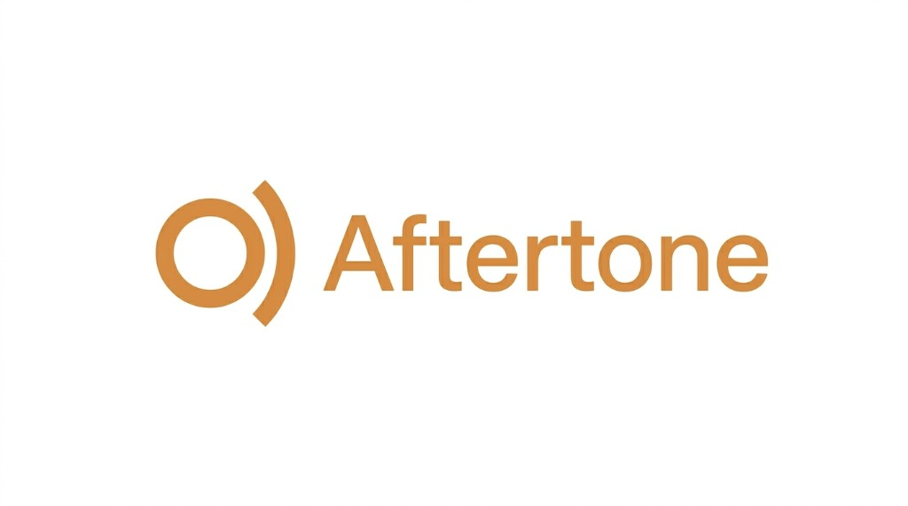

# Aftertone

<p align="center">
  
</p>

**Hear a short spoken line after your coding agent answers** — on-device **[Supertonic](https://github.com/supertone-inc/supertonic) ONNX** through a tiny **local HTTP daemon** (models stay loaded; hooks stay fast).

One daemon, thin adapters per tool — **Cursor ships today**; more agents are on the roadmap. Want to help? See [CONTRIBUTING.md](CONTRIBUTING.md) and the **Adapter research** issue template.

## Works with

<p align="center">
  <strong>AI coding agents &amp; IDEs</strong><br>
  <sub>Same local <code>tts_daemon</code> — each adapter wires “reply finished” → short spoken line</sub>
</p>

<p align="center">
  <table>
    <tr>
      <td align="center" width="128">
        <a href="https://cursor.com" title="Cursor"></a><br>
        <strong>Cursor</strong><br>
        <sub>✅ Available</sub>
      </td>
      <td align="center" width="128">
        <a href="https://docs.anthropic.com/en/docs/claude-code" title="Claude Code"></a><br>
        <strong>Claude Code</strong><br>
        <sub>Coming soon</sub>
      </td>
      <td align="center" width="128">
        <a href="https://developers.openai.com/codex" title="OpenAI Codex"></a><br>
        <strong>Codex</strong><br>
        <sub>Coming soon</sub>
      </td>
      <td align="center" width="128">
        <a href="https://opencode.ai" title="OpenCode"></a><br>
        <strong>OpenCode</strong><br>
        <sub>Coming soon</sub>
      </td>
      <td align="center" width="128">
        <a href="https://github.com/features/copilot" title="GitHub Copilot"></a><br>
        <strong>GitHub Copilot</strong><br>
        <sub>Coming soon</sub>
      </td>
    </tr>
    <tr>
      <td align="center" width="128">
        <a href="https://windsurf.com" title="Windsurf"></a><br>
        <strong>Windsurf</strong><br>
        <sub>Coming soon</sub>
      </td>
      <td align="center" width="128">
        <a href="https://www.jetbrains.com/ai/" title="JetBrains AI"></a><br>
        <strong>JetBrains AI</strong><br>
        <sub>Coming soon</sub>
      </td>
      <td align="center" width="128">
        <a href="https://zed.dev" title="Zed"></a><br>
        <strong>Zed</strong><br>
        <sub>Coming soon</sub>
      </td>
      <td align="center" width="128">
        <a href="https://cline.bot" title="Cline"></a><br>
        <strong>Cline</strong><br>
        <sub>Coming soon</sub>
      </td>
      <td align="center" width="128">
        <a href="https://www.continue.dev" title="Continue"></a><br>
        <strong>Continue</strong><br>
        <sub>Coming soon</sub>
      </td>
    </tr>
  </table>
</p>

<p align="center">
  <sub>Missing your stack? Open an <a href="https://github.com/omarelkhal/aftertone/issues/new?template=adapter_research.md">adapter research</a> issue — tracked in <a href="CONTRIBUTING.md#what-were-building">CONTRIBUTING</a>.</sub>
</p>

## Discovery

If you are searching for **local text-to-speech**, **on-device** assistants, **AI coding agent** tooling, **agentic coding** workflows, or **Cursor IDE** **hooks** that do not send your thread to a cloud API — Aftertone is a small **open source** **developer tool**: **ONNX Runtime** + **Supertonic** for optional **voice** feedback after the model answers, **offline**-friendly and **privacy**-minded.

**Related GitHub topics:** [ai-agents](https://github.com/topics/ai-agents) · [coding-agent](https://github.com/topics/coding-agent) · [cursor](https://github.com/topics/cursor) · [text-to-speech](https://github.com/topics/text-to-speech) · [onnx](https://github.com/topics/onnx) · [local-first](https://github.com/topics/local-first) · [developer-tools](https://github.com/topics/developer-tools) · [open-source](https://github.com/topics/open-source)

## Features (today)

- **Cursor:** `afterAgentResponse` → optional TTS from inline reply text (prefers `<spoken_summary>…</spoken_summary>`).
- `speak_summary_prepare.py` → JSON for `POST /say`; `tts_daemon.py` → localhost server.
- Optional `stop` hook trace for debugging.
- `bash scripts/bootstrap.sh` — `uv sync`, Hugging Face assets if `assets/onnx/` is missing.

## Requirements

- [uv](https://docs.astral.sh/uv/getting-started/installation/)
- **Cursor (current adapter):** Hooks on, **trusted** workspace, `.cursor/hooks.json` with `"version": 1`.
- ONNX weights under `./assets` (`Supertone/supertonic-3` — bootstrap downloads them).

## Quick start

```bash
git clone https://github.com/omarelkhal/aftertone.git
cd aftertone
bash scripts/bootstrap.sh
```

**Cursor:** open this folder as the workspace root so project hooks load.

- **Daemon:** `cd py && uv run python tts_daemon_ctl.py status --repo-root ..`
- **Smoke (needs assets + audio):** `bash py/test_speak_summary_pipeline.sh`
- **Diagnostics:** `bash py/diagnose_speak_hooks.sh`

### Repo root env (any adapter)

Hooks and Python resolve the install root via **`AFTERTONE_REPO`** (preferred) or legacy **`SUPERTONIC_REPO`**.

### Copy into another repo

Bring `.cursor/` + `py/` (or symlink). Keep `speak_summary.toml` paths consistent (`../assets/onnx`, etc.).

## Configuration

| Doc / file | Role |
|------------|------|
| **[`.cursor/hooks/README.md`](.cursor/hooks/README.md)** | **Full reference:** every `speak_summary.toml` key (including **`spoken_summary_max_chars`**, **`heuristic_max_chars`**, **`plain_excerpt_max_chars`**, **`only_speak_spoken_summary`**), valid `lang` codes, heuristics, `quiet_hours`, daemon **start / stop / status / restart**, logs, smoke test, when TOML changes need a restart, and **`sync_spoken_rule_lang.py`** after changing `lang`. |
| [`.cursor/hooks/speak_summary.toml`](.cursor/hooks/speak_summary.toml) | Port, voice, `lang`, speed, GPU, quiet hours, limits, heuristics, tag-only mode. |
| [`.cursor/rules/spoken-summary.mdc`](.cursor/rules/spoken-summary.mdc) | When/how to emit `<spoken_summary>`; **match TOML `lang`** (synced blurb — run `uv run --directory py python sync_spoken_rule_lang.py` from repo root after edits). |
| **[`AGENTS.md`](AGENTS.md)** | Cursor TTS digest (flow, verify hooks, caps, “nothing speaks”). |

Disable speech: `enabled = false` in `speak_summary.toml`.

## Contributing

See **[CONTRIBUTING.md](CONTRIBUTING.md)** and the **[Code of Conduct](CODE_OF_CONDUCT.md)**. **Issues:** [open one here](https://github.com/omarelkhal/aftertone/issues) — use a template (**Bug report**, **Feature or idea**, **Adapter research**). Starter ideas: [.github/STARTER_ISSUES.md](.github/STARTER_ISSUES.md).

## Website

**[aftertone on GitHub Pages](https://omarelkhal.github.io/aftertone/)** — home + **[docs](https://omarelkhal.github.io/aftertone/docs.html)** (install steps, daemon, config, troubleshooting). Built from [`docs/`](docs/). Enable in the **repository** (not your profile): **aftertone → Settings → Pages** → source **Deploy from a branch**, branch **`main`**, folder **`/docs`**.

## License

MIT — [LICENSE](LICENSE). Supertonic-derived code: [NOTICE](NOTICE).

## Publish to GitHub

```bash
cd /path/to/aftertone
git remote add origin https://github.com/omarelkhal/aftertone.git
git push -u origin main
```

Or: `gh repo create aftertone --public --source=. --remote=origin --push`
